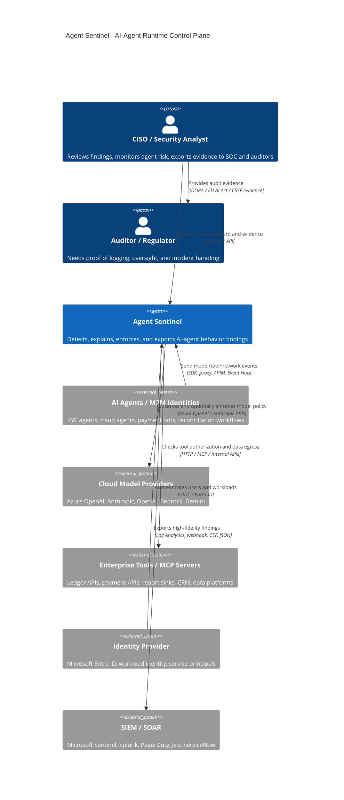

# Part 1 — Why AI Agents Need a Flight Recorder

**LinkedIn hook:**

> Your payment reconciliation agent just called an LLM, invoked a ledger tool, and sent 250KB to a host nobody approved. Could you prove what happened?

Traditional logs tell you that an HTTP request occurred. Agent Sentinel explains **which agent acted, which model it used, which tool it called, what policy it violated, and what evidence proves it**.

## C4 Level 1 — System Context



## Implementation details

The core loop is deliberately small:

```text
collector -> parser -> AgentEvent -> detection engine -> Finding -> storage -> dashboard/SIEM
```

| Repo Area | What It Implements |
|---|---|
| `app/sentinel/schema/events.py` | Normalized `AgentEvent`, `Finding`, `Evidence`, severity, and action types |
| `app/sentinel/collector/parsers.py` | Classifies raw traffic as `LLM_CALL`, `TOOL_CALL`, `NETWORK_CALL`, or `DATA_ACCESS` |
| `app/sentinel/detection/engine.py` | Deterministic policy checks plus baseline anomaly checks |
| `app/sentinel/explain/explainer.py` | Human-readable finding explanations with policy clauses and control refs |
| `app/sentinel/storage/store.py` | DuckDB local storage for POC and local pilots |
| `app/sentinel/storage/pg_store.py` | PostgreSQL / TimescaleDB storage for enterprise-grade persistence |
| `app/sentinel/api/main.py` | REST API, SSE stream, approvals, audit log, dashboard serving |
| `dashboard/index.html` | CISO dashboard with live findings, evidence drawer, approvals, events feed |

Next: [Part 2 — From Simulated Traffic to Real Model Calls](02-simulation-to-real-models.md).
