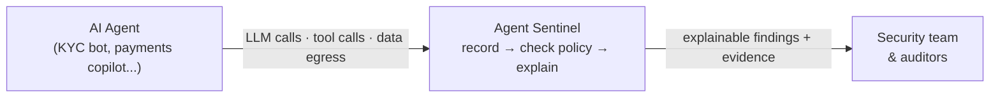

# Part 1 — Why AI Agents Need a Flight Recorder

> Your payment reconciliation agent just called an LLM, invoked a ledger tool, and sent 250KB of data to a server nobody approved. Could you prove what happened?

## The problem, in plain terms

Companies are starting to let AI agents do real work: reconcile payments, check customer identities, draft reports. These agents are effectively **new employees with system access** — they read data, use internal tools, and talk to the internet.

But unlike a human employee, nobody is watching them work. If an agent does something wrong — by mistake, by manipulation, or by going off-script — most companies today could not reconstruct what happened, let alone prove it to a regulator.

Airplanes solved this decades ago: the flight recorder. It doesn't fly the plane; it makes sure that whatever happens, there is trustworthy evidence of it.

## The problem, for the technical reader

An AI agent produces three kinds of traffic: **LLM calls** (which model, what was sent), **tool calls** (which API or MCP tool, with what arguments), and **network egress** (where did data go, how much). Your existing logs will tell you "an HTTPS request occurred." They won't tell you *which agent* acted, *whether that tool was allowed for it*, or *why this matters for DORA or the EU AI Act*.

**Agent Sentinel** is a flight recorder and behavioral firewall for AI agents. It intercepts that traffic, checks it against explicit policy, and produces findings a security analyst — and an auditor — can actually read.

Every alert answers five questions: **which agent** acted, **which model** it used, **which tool** it called, **what policy** it violated, and **what evidence** proves it.

## Dig into the code

- Event and finding schema: [`app/sentinel/schema/events.py`](https://github.com/anandnarayanan2017/agent-sentinel/blob/master/app/sentinel/schema/events.py)
- Detection engine: [`app/sentinel/detection/engine.py`](https://github.com/anandnarayanan2017/agent-sentinel/blob/master/app/sentinel/detection/engine.py)
- Explainability layer: [`app/sentinel/explain/explainer.py`](https://github.com/anandnarayanan2017/agent-sentinel/blob/master/app/sentinel/explain/explainer.py)
- Full architecture: [`docs/ARCHITECTURE.md`](https://github.com/anandnarayanan2017/agent-sentinel/blob/master/docs/ARCHITECTURE.md)

Next: [Part 2 — Record First, Enforce Later](02-simulation-to-real-models.md)
