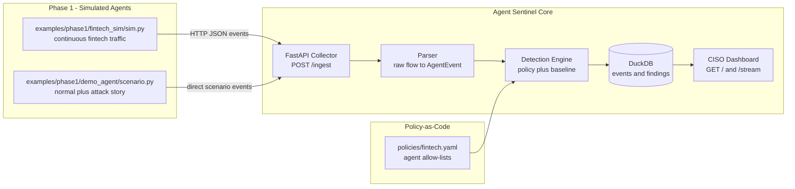
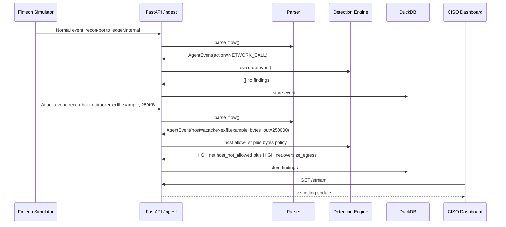
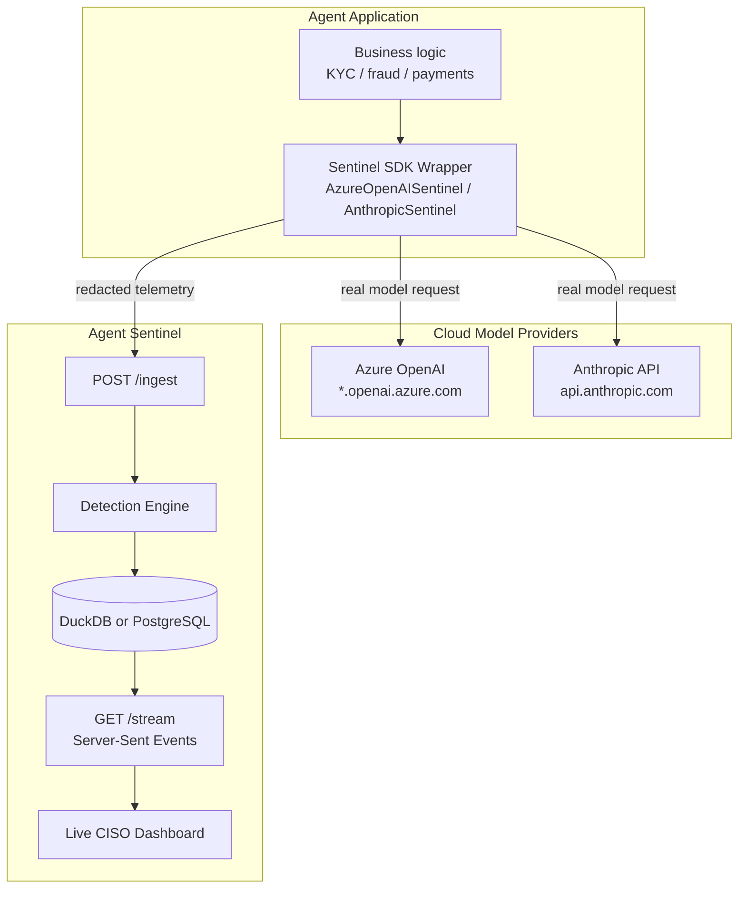
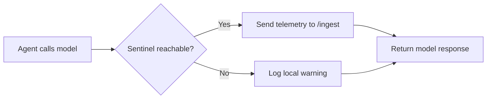

# Part 2 — From Simulated Traffic to Real Model Calls

**LinkedIn hook:**

> Start small: before blocking agent behavior, record it well enough that a CISO can trust the evidence.

Phase 1 proves the core idea with simulated fintech traffic, deterministic policy checks, DuckDB storage, and a local dashboard. Phase 2 then swaps simulation for real Azure OpenAI / Anthropic calls without changing the core loop.

## Phase 1 — the POC flight recorder



| Capability | Implementation |
|---|---|
| Event simulation | `examples/phase1/fintech_sim/sim.py` creates realistic fintech network traffic |
| Policy-as-code | `policies/fintech.yaml` defines allowed hosts, tools, models, bytes, and controls |
| Normalization | `parse_flow()` converts raw traffic into one `AgentEvent` schema |
| Detection | Rules catch unapproved hosts, tools, models, oversize egress, and rate violations |
| Evidence | Findings include title, rule, severity, explanation, evidence, and control refs |
| Storage | DuckDB tables: `events` and `findings` |
| UX | Local CISO board with severity cards, charts, filters, evidence drawer, event feed |

```yaml
agents:
  - agent_id: recon-bot
    allowed_hosts:
      - api.anthropic.com
      - ledger.internal
      - reports.internal
    allowed_tools:
      - read_ledger
      - send_report
    allowed_models:
      - claude-sonnet-4-6
    max_tool_calls_per_session: 20
    max_bytes_out_per_call: 100000
    control_refs:
      - "DORA Art.10 (anomaly detection)"
      - "EU AI Act Art.12 (logging)"
      - "CSSF 20/750 (ICT risk)"
```



## Phase 2 — real cloud models



```python
from sentinel.collector.azure_openai import AzureOpenAISentinel

client = AzureOpenAISentinel(
    azure_endpoint=os.environ["AZURE_OPENAI_ENDPOINT"],
    api_key=os.environ["AZURE_OPENAI_API_KEY"],
    api_version=os.environ["AZURE_OPENAI_API_VERSION"],
    sentinel_api=os.environ.get("SENTINEL_API", "http://localhost:8000"),
    agent_id="kyc-agent",
    session_id="kyc-run-001",
)

response = client.chat.completions.create(
    model=os.environ["AZURE_OPENAI_DEPLOYMENT"],
    messages=[
        {"role": "user", "content": "Summarize this KYC discrepancy."}
    ],
)
```

| Step | What Happens |
|---|---|
| 1 | Sends the real call to Azure OpenAI or Anthropic |
| 2 | Builds redacted telemetry: host, path, model, message count, bytes, status |
| 3 | Posts the event to `POST /ingest` for policy evaluation |

| File | Role |
|---|---|
| `app/sentinel/collector/sdk_base.py` | Shared fail-open HTTP reporter |
| `app/sentinel/collector/azure_openai.py` | Azure OpenAI wrapper |
| `app/sentinel/collector/anthropic_sdk.py` | Anthropic wrapper |
| `examples/phase2/azure_agent.py` | Azure OpenAI example agent |
| `examples/phase2/anthropic_agent.py` | Anthropic example agent |
| `examples/phase2/.env.example` | Required environment variable template |
| `start_phase2.sh` | One-command Phase 2 launcher |

### Why fail open first?

For early observability, Sentinel should not break production agents if the collector is temporarily unavailable.



Later enforcement modes can become stricter:

| Mode | Behavior |
|---|---|
| Observe | Never block, only record |
| Warn | Record and alert |
| Block | Stop calls violating policy |
| Quarantine | Disable agent/session after critical events |

Next: [Part 3 — Rules First, Statistics Second](03-rules-first-statistics-second.md).
