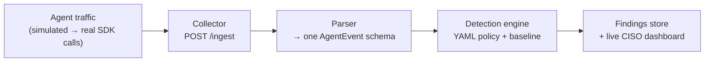

# Part 2 — Record First, Enforce Later

> Before you block an AI agent's behavior, record it well enough that a CISO can trust the evidence.

## In plain terms

You don't start policing traffic by handing out fines — you start by installing the dashcam. Agent Sentinel's first job was the same: **watch and record reliably before ever blocking anything**.

We built it in two steps. First, a working prototype fed with *simulated* bank-agent traffic — safe, repeatable, and easy to demo an attack in. Then we swapped the simulation for **real AI model calls** (Azure OpenAI, Anthropic) without changing anything else.

## For the technical reader

The core loop stayed identical through both phases:

Three design choices did the heavy lifting:

1. **One normalized schema.** Everything — LLM call, tool call, network egress — becomes an `AgentEvent`. Detectors never see provider-specific formats.
2. **Policy as readable YAML.** Each agent gets an envelope: allowed hosts, tools, models, egress limits — with regulatory control references attached. An auditor can read it.
3. **Fail-open SDK wrappers.** Real model calls go through a thin wrapper that sends redacted telemetry (host, model, byte counts — not prompts) to the collector. If the collector is down, the agent keeps working. Observability should never be the outage.

Blocking modes (warn → block → quarantine) come later, once the recording is trusted.

## Dig into the code

- Fintech traffic simulator: [`examples/phase1/fintech_sim/sim.py`](https://github.com/anandnarayanan2017/agent-sentinel/blob/master/examples/phase1/fintech_sim/sim.py)
- Example policy envelope: [`policies/fintech.yaml`](https://github.com/anandnarayanan2017/agent-sentinel/blob/master/policies/fintech.yaml)
- Azure OpenAI wrapper: [`app/sentinel/collector/azure_openai.py`](https://github.com/anandnarayanan2017/agent-sentinel/blob/master/app/sentinel/collector/azure_openai.py)
- Anthropic wrapper: [`app/sentinel/collector/anthropic_sdk.py`](https://github.com/anandnarayanan2017/agent-sentinel/blob/master/app/sentinel/collector/anthropic_sdk.py)

Next: [Part 3 — Rules First, Statistics Second](03-rules-first-statistics-second.md)
