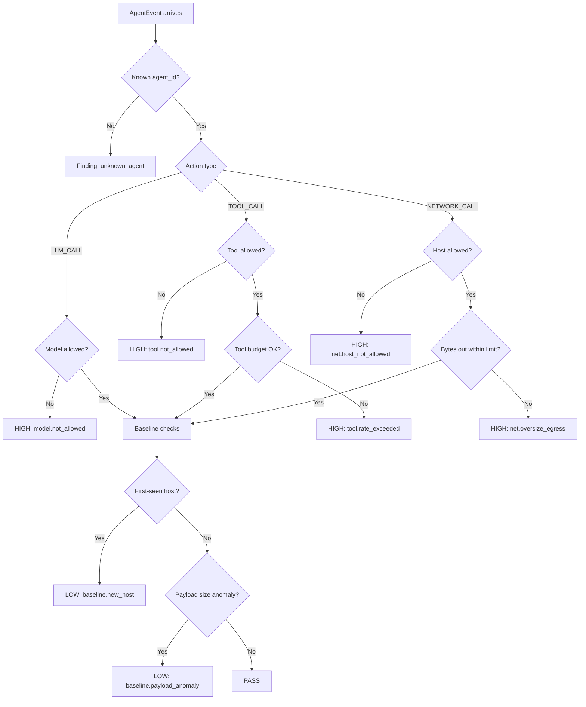

# Part 3 — Rules First, Statistics Second

**LinkedIn hook:**

> The first enterprise AI controls should be boring, deterministic, and auditable.

Agent Sentinel is rules-first by design. A black-box model should not be the primary judge of whether another model-powered agent is allowed to move money, call a tool, or exfiltrate data.

## Policy decision tree



```python
findings = engine.evaluate(event)
for finding in findings:
    store.insert_finding(finding)
```

The important design choice: **the engine never parses raw HTTP**. It only understands the normalized schema.

| Layer | Owns |
|---|---|
| Collector | Capturing traffic from SDK, proxy, APIM, or future eBPF |
| Parser | Turning provider-specific traffic into `AgentEvent` |
| Engine | Evaluating policy and baseline rules |
| Explainer | Turning rule outcomes into audit-friendly findings |
| Storage | Persisting events, findings, approvals, and audit trail |

## When rules aren't enough: teaching Sentinel what normal looks like

**LinkedIn hook:**

> A wire-transfer tool call is legal. A wire-transfer tool call *before* the identity-verification step is a breach. No YAML allow-list can tell the difference — the rule has to understand order.

Rules-first is what a fintech auditor can actually read and trust. But a policy engine checks each event against a static envelope, one call at a time — it cannot see that step 3 came before step 2, or that a normally-idle agent just made fifteen calls in a row, or that this session's *shape* looks nothing like every other session this role has ever run. Those are sequence properties, and sequences need a different kind of model.

`sentinel_sequence` is that model: an order-1/2 Markov chain over each agent role's normal action sequences, scored against new sessions by how surprising they are.

```text
AgentEvents -> split_sessions -> Tokenizer -> MarkovModel -> score_session -> evidence chain
   (DuckDB)     (gap or          (frozen        (order 1/2,     (mean NLL +      ("expected {A,B},
                 session_id)      vocab, UNK)    smoothed)       top-k surprise)   observed C")
```

Every event becomes a token (`tool:verify_id`, `llm:call`, `net:egress_new_domain`). The model learns, per role, which tokens follow which — then scores a new session by how unlikely its transitions are under that learned distribution.

### The dilution problem

The first version scored sessions by mean surprise per step (mean negative log-likelihood). It looked reasonable in isolation and turned out to be the wrong metric: a handful of injected malicious steps, diluted across an otherwise-normal ten-step session, barely move an average.

| Model / score | Precision | Recall | F1 |
|---|---|---|---|
| order-1, mean NLL | 1.000 | 0.740 | 0.851 |
| order-2, mean NLL | 0.978 | 0.880 | 0.926 |
| order-1, top-3 surprise | 0.980 | 1.000 | 0.990 |
| **order-2, top-3 surprise** | **0.980** | **1.000** | **0.990** |

Mean-NLL missed a quarter to half of the privilege-escalation sessions in evaluation — the injected steps were real outliers, just outvoted by the rest of the session. Switching to the mean of the *k* most surprising steps (top-k surprise) instead of the session-wide mean fixed it: concentrated anomalies stop getting outvoted by the normal steps around them. Same model, different aggregation, F1 0.85 to 0.99.

### Fusion contract — advisory only

`sentinel_sequence` never gets to say no. It sits alongside the Phase 1 statistical baseline as a second advisory signal:

| Layer | May deny? | Role |
|---|---|---|
| YAML policy engine | Yes | Compliance-binding allow/deny |
| Statistical baseline | No | Windowed feature anomalies -> severity signal |
| Sequence model | No | Behavioral-sequence anomalies -> severity signal + evidence chain |

Every flagged session comes with the same evidence-chain discipline as a policy finding — not "87% anomalous," but "step 4: after [verify_id -> check_sanctions_list], expected {write_case_note (p=0.71), flag_for_review (p=0.22)}; observed initiate_wire_transfer (p=0.003)."

### What's real today

Built and hardened: the tokenizer, order-1/2 Markov scoring, a versioned per-role model registry with atomic publish and integrity checksums, and drift detection (median-surprise-ratio, so a role's prompt/toolset changing legitimately triggers "model stale, retrain" instead of an alert storm). A hardening pass closed ten real bugs found in code review — including a SQL-injection surface in the DuckDB column-mapping config and a TOCTOU gap in model-checksum verification — taking it to 94 passing tests at 95%+ coverage. It is now wired into `detection/engine.py` alongside the policy and baseline layers as an optional, advisory-only L3 layer (`SENTINEL_SEQ_ENABLED`, off by default).

### Stress-testing on a second, harder role

**LinkedIn hook:**

> 0.99 F1 on one role is a demo number. The interesting question is where a sequence model actually breaks — so we built a second, harder role to find out.

`kyc_bot_demo` has 12 actions across 4 templates and 4 fixed attack functions — small enough that near-perfect recall doesn't tell you much about where the model's limits are. `payments_bot_demo` (`app/sentinel_sequence/data_gen_payments.py`) doubles the vocabulary to 25 actions across 8 templates, and replaces fixed attack *functions* with a library of 7 attack *primitives* composed 1-2 at a time at randomized injection points — 24 distinct observed attack-label combinations in a 100-session eval, not 4.

| Model / score | Precision | Recall | F1 |
|---|---|---|---|
| order-1, mean NLL | 0.976 | 0.830 | 0.897 |
| order-2, mean NLL | 0.974 | 0.740 | 0.841 |
| **order-2, top-3 surprise** | **0.987** | **0.770** | **0.865** |

Lower than `kyc_bot_demo`'s numbers — and *why* is the actual finding. Every multi-primitive attack (two primitives injected together) scores **1.000 recall**, 17/17 combinations perfectly caught. The gap is entirely in small, single-primitive injections:

| Single primitive alone | Recall |
|---|---|
| `exfiltration_burst` (3-6 extra net-egress events) | **0.000** |
| `unauthorized_override` (2 extra events) | **0.167** |
| `limit_bypass` (3 extra events) | **0.500** |
| `order_abuse` (whole-session reorder, no extra length) | 0.875 |
| `burst_loop`, `credential_probe`, `silent_cancel_replay` alone | 1.000 |

A 2-3 event injection inside an otherwise-normal 9-14 event session dilutes the same way mean-NLL diluted across a whole session — top-k surprise has its own dilution floor one level up, once sessions get long enough and injections small enough relative to session length. That's a real, useful limit surfaced by a harder eval, not a number to bury: **small, quiet attacks are the hardest thing for this layer to catch**, which is exactly why it's advisory-only, fused with policy and baseline rather than trusted alone.

This role was also the first to run all the way through the real `app.sentinel.detection.engine.Engine` — not just the standalone `sentinel_sequence` scorer — proving the L3 wiring end to end:

```text
rule_id=sequence.anomaly severity=MEDIUM
  title="Sequence behavior anomaly for role 'payments_bot_demo'"
  explanation: session behavior deviates from learned payments_bot_demo
    baseline (surprise 4.95 > threshold 4.37, model v0001)
  evidence: seq_step_0=step 9: after [tool:cancel_payment], expected
    {tool:write_case_note (p=0.70), tool:close_case (p=0.08),
    llm:call (p=0.04)}; observed tool:verify_2fa (p=0.0064)
```

Same honesty discipline as everywhere else in this repo: this is still self-authored synthetic data (`docs/EVAL_PAYMENTS_BOT.md` carries the full caveat), so it's a robustness stress-test and an integration proof, not a real-world performance claim. What it proves is narrower and more useful than a bigger F1 number would be — *where* the current approach is strong and *where* it isn't, on a case that was deliberately built to be harder than the first one.

Next: [Part 4 — The Enterprise Foundation](04-enterprise-foundation.md).
