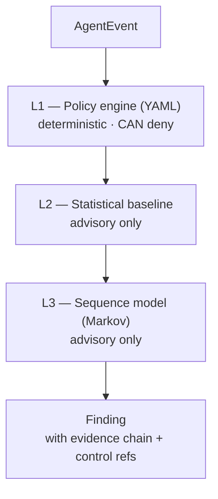

# Part 3 — Rules First, Statistics Second

> A wire transfer is legal. A wire transfer *before* the identity check is a breach. The order of events matters — and so does who gets to say "no".

## In plain terms

When AI watches AI, who do you trust? Agent Sentinel's answer: **the rulebook decides, the intuition only advises.**

The primary judge is a set of boring, explicit, human-readable rules: this agent may use these tools, talk to these servers, send at most this much data. A rule either fires or it doesn't — an auditor can verify it.

On top of that sits a statistical layer that learns what "normal" looks like for each agent and flags the unusual. But it is **advisory only** — it can raise a hand, never block. A black-box score should not be the reason a payment bot gets shut down.

## For the technical reader

The sequence layer exists because allow-lists can't see *order*. A Markov model learns, per agent role, which action typically follows which — then scores new sessions by how surprising their transitions are.

Two honest lessons from evaluation:

- **Averages hide attacks.** Scoring a session by *mean* surprise let a few malicious steps get outvoted by the normal ones around them. Switching to the top-k most surprising steps took F1 from 0.85 to 0.99 on the first test role.
- **Small, quiet attacks are still the hardest.** A deliberately harder second role showed 2–3 event injections inside long normal sessions can slip past even top-k scoring. That limit is exactly *why* the layer is advisory-only and fused with policy rather than trusted alone.

And every flag stays explainable — not "87% anomalous," but: *after `verify_id → check_sanctions`, expected `write_case_note` (p=0.71); observed `initiate_wire_transfer` (p=0.003).*

## Dig into the code

- Policy engine: [`app/sentinel/detection/policy.py`](https://github.com/anandnarayanan2017/agent-sentinel/blob/master/app/sentinel/detection/policy.py)
- Sequence-anomaly subsystem: [`app/sentinel_sequence/`](https://github.com/anandnarayanan2017/agent-sentinel/tree/master/app/sentinel_sequence)
- Hard-role evaluation write-up: [`docs/EVAL_PAYMENTS_BOT.md`](https://github.com/anandnarayanan2017/agent-sentinel/blob/master/docs/EVAL_PAYMENTS_BOT.md)

Next: [Part 4 — The Enterprise Foundation](04-enterprise-foundation.md)
