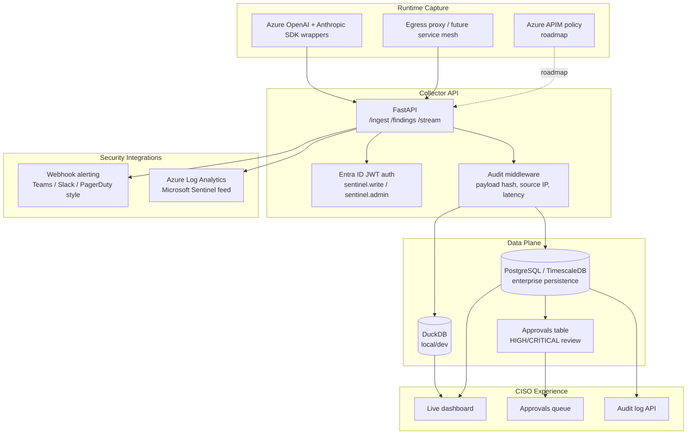

# Part 4 — The Enterprise Foundation

**LinkedIn hook:**

> The difference between a demo and an enterprise platform is not prettier charts. It is identity, storage, auditability, approvals, and operations.

Phase 3 turns the pilot into something a regulated security team can evaluate seriously.

## Phase 3 enterprise architecture

| Capability | Current Repo Implementation | Notes |
|---|---|---|
| Auth | `app/sentinel/api/auth.py` | Entra ID JWT validation when `AZURE_TENANT_ID` and `AZURE_CLIENT_ID` are set; dev bypass otherwise |
| Audit trail | `app/sentinel/api/audit.py` | Captures endpoint, source IP, payload hash, status, latency, user id |
| PostgreSQL / TimescaleDB | `app/sentinel/storage/pg_store.py` | Activated through `DATABASE_URL`; falls back to DuckDB when absent |
| Approval workflow | `/approvals`, `/approvals/{id}` | Auto-created for high/critical findings in Postgres backend |
| SSE live stream | `/stream` | Pushes stats, findings, events, pending approvals every 1.5 seconds |
| Webhook alerting | `app/sentinel/alerting/webhook.py` | Sends high-signal findings to webhook targets |
| Log Analytics export | `app/sentinel/siem/log_analytics.py` | Pushes findings to Azure Monitor / Log Analytics |

## Enterprise gaps still open

| Gap | Why It Matters | Roadmap Direction |
|---|---|---|
| Multi-tenancy | Enterprises need org/team/env isolation | Add `tenant_id`, `org_id`, `environment` across schema and policy |
| Policy lifecycle | YAML files do not scale to many teams | Policy API, GitOps sync, approvals, version history |
| Queue-backed ingestion | Direct HTTP can struggle during bursts | Azure Event Hub or Kafka with replay and DLQ |
| Key management | Env vars are not enough for regulated deployment | Azure Key Vault, managed identity, customer-managed keys |
| HA deployment | Single-node is not production enough | Azure Container Apps/AKS, horizontal replicas, health probes |

## The two-gate SDLC behind the code

Worth showing, not just the runtime architecture: every change in this repo goes through a disciplined two-gate process — a human signs off a frozen spec (Gate 1), then spec-agent → architect → adr-critic → build → code-reviewer/security-reviewer → test → UAT → trust evaluation run before a human approves the Gate 2 evidence bundle for production. `spec/`, `design/`, and `evidence/` are the transient artifacts of that pipeline for the in-flight change; `archive/` keeps a record of completed runs. That process discipline is itself part of the "auditable by design" pitch — the same reasoning behind the compliance-control mapping.

Next: [Part 5 — Feeding the SOC, and What's Next](05-soc-and-whats-next.md).
