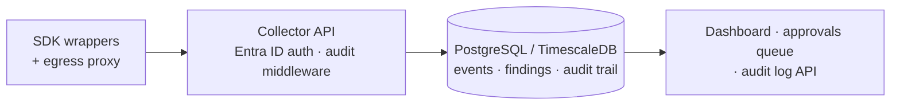

# Part 4 — The Enterprise Foundation

> The difference between a demo and an enterprise platform is not prettier charts. It is identity, storage, auditability, and approvals.

## In plain terms

A cool demo answers "does it work?". A bank's security team asks different questions: **Who is allowed to see this? Can you prove nobody tampered with the records? When something serious is flagged, who reviews it and where is that decision recorded?**

Phase 3 of Agent Sentinel was about answering those questions — the unglamorous plumbing that makes a regulated buyer take the product seriously.

## For the technical reader

What got built:

- **Identity:** Entra ID JWT auth on the API — agents and humans authenticate like any other enterprise workload.
- **Durable storage:** PostgreSQL/TimescaleDB backend (DuckDB stays for local dev), so evidence survives and scales.
- **Audit trail:** every API call recorded with source, payload hash, and latency — the recorder itself is auditable.
- **Approvals:** HIGH/CRITICAL findings automatically open a review item; a human decision becomes part of the record.

Just as honestly, what's still open: multi-tenancy, a policy lifecycle beyond YAML files, queue-backed ingestion, and HA deployment. Naming the gaps is part of the credibility.

One more layer of "auditable by design": the codebase itself is built through a two-human-gate SDLC — a signed-off frozen spec on one end, an evidence bundle a human approves on the other, with AI agents doing the work in between under hooks that enforce the rules.

## Dig into the code

- API auth: [`app/sentinel/api/auth.py`](https://github.com/anandnarayanan2017/agent-sentinel/blob/master/app/sentinel/api/auth.py)
- Audit middleware: [`app/sentinel/api/audit.py`](https://github.com/anandnarayanan2017/agent-sentinel/blob/master/app/sentinel/api/audit.py)
- Postgres/TimescaleDB store: [`app/sentinel/storage/pg_store.py`](https://github.com/anandnarayanan2017/agent-sentinel/blob/master/app/sentinel/storage/pg_store.py)
- Compliance mapping: [`docs/COMPLIANCE.md`](https://github.com/anandnarayanan2017/agent-sentinel/blob/master/docs/COMPLIANCE.md)

Next: [Part 5 — Feeding the SOC, and What's Next](05-soc-and-whats-next.md)
