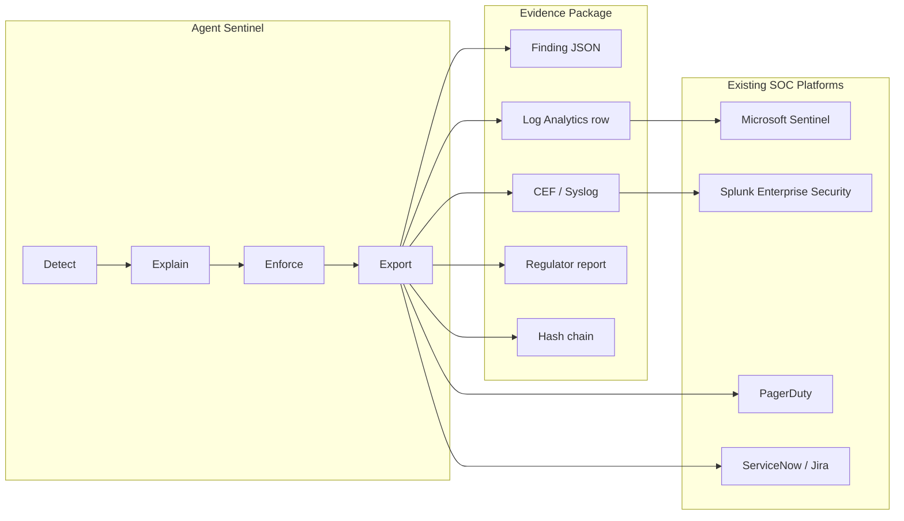
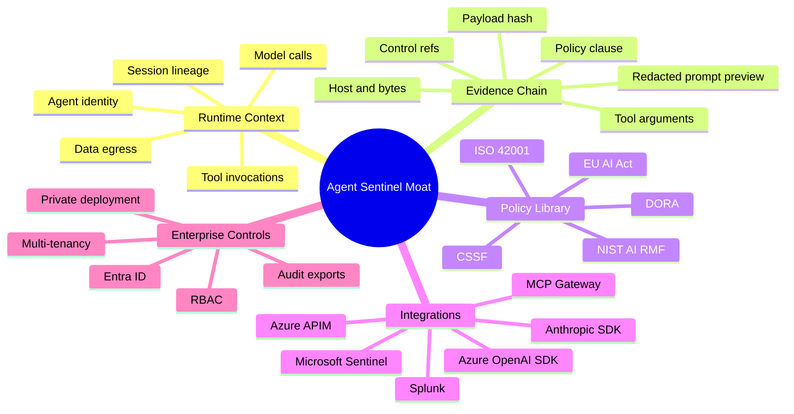

# Part 5 — Feeding the SOC, and What's Next

**LinkedIn hook:**

> Agent Sentinel should not be another SIEM. It should produce the AI-agent evidence your SIEM does not have natively.

Microsoft Sentinel and Splunk already do SIEM/SOAR well. Agent Sentinel should export high-fidelity AI-agent findings into them.

## SOC integration architecture



| Integration | Status | Implementation Direction |
|---|---|---|
| Azure Log Analytics | Implemented foundation | `app/sentinel/siem/log_analytics.py` |
| Webhook alerting | Implemented foundation | `app/sentinel/alerting/webhook.py` |
| Microsoft Sentinel workbook | Roadmap | KQL workbook over custom Agent Sentinel table |
| Microsoft Sentinel analytic rules | Roadmap | Rules for critical agent egress, forbidden tool, shadow model |
| Splunk HEC | Roadmap | HTTP Event Collector JSON events |
| Splunk ES app | Roadmap | Notable events, dashboards, investigation workflow |
| ServiceNow / Jira | Roadmap | Ticket creation for escalated approvals |
| Evidence PDF export | Roadmap | Regulator-ready bundle with hash chain |

| Capability | Sentinel / Splunk | Agent Sentinel |
|---|---|---|
| Enterprise log ingestion | Excellent | Feeds enriched AI-agent events into them |
| Incident correlation | Excellent | Provides high-fidelity AI-agent findings |
| SOAR playbooks | Excellent | Triggers them |
| LLM prompt/tool context | Generic unless custom-built | First-class event schema |
| Pre-call enforcement | Limited without custom gateway | Product direction |
| Agent policy-as-code | Not native | Core product feature |
| Evidence chain for AI actions | Custom content | First-class artifact |
| DORA / EU AI Act evidence | Custom reporting | Built into finding model |

```text
Do not sell Agent Sentinel as an AI SIEM.
Sell it as the AI-agent runtime control and evidence layer for existing SIEMs.
```

## OSS, enterprise, and the moat

**LinkedIn hook:**

> The moat is not the dashboard. The moat is the agent behavior graph and the evidence chain.



| Area | OSS | Enterprise |
|---|---|---|
| SDK wrappers | Yes | Supported/certified versions |
| Event schema | Yes | Version governance and migration tooling |
| Local collector | Yes | HA collector fleet |
| YAML rules | Yes | Policy workflow, approvals, GitOps |
| DuckDB storage | Yes | Postgres/ClickHouse/Event Hub |
| Dashboard | Yes | RBAC, tenancy, executive reporting |
| SIEM examples | Yes | Certified Sentinel/Splunk apps |
| Compliance mappings | Starter pack | Regulated industry packs and evidence exports |
| Enforcement | Observe/warn | APIM/proxy/block/quarantine modes |

## POC to enterprise grade — the whole arc

| Dimension | Phase 1 POC | Phase 2 Real Pilot | Phase 3 Enterprise Foundation |
|---|---|---|---|
| Ingestion | Simulated HTTP events | Azure/Anthropic SDK wrappers | SDK + proxy + auth + audit |
| Models | Simulated/provider-parsed | Azure OpenAI and Anthropic | Multi-provider governance |
| Storage | DuckDB | DuckDB file or local DB | PostgreSQL / TimescaleDB |
| Detection | YAML rules + baseline | Same engine on real calls | Versioned policy service |
| UX | Local CISO dashboard | Live SSE dashboard | Authenticated dashboard + approvals |
| Identity | Manual `agent_id` | SDK-provided identity | Entra ID and workload identity |
| Enforcement | Observe | Observe/warn | Block/quarantine roadmap |
| Compliance | Control refs | Real-call evidence | Audit log + approvals |
| Deployment | Local / Docker | Staging container | Azure Container Apps / AKS roadmap |
| Product Readiness | Demo | Pilot | Enterprise beta foundation |

Back to [Part 1](01-why-agents-need-a-flight-recorder.md) · [series index](README.md).
