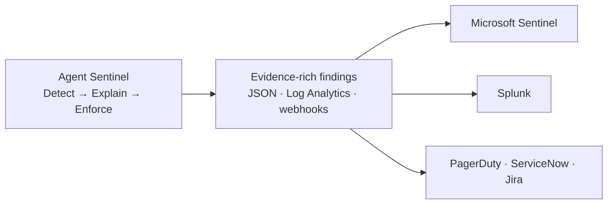

# Part 5 — Feeding the SOC, and What's Next

> Agent Sentinel should not be another SIEM. It should produce the AI-agent evidence your SIEM doesn't have.

## In plain terms

Every large company already has a security control room (a SOC) with big, mature platforms — Microsoft Sentinel, Splunk — watching everything. The last thing they need is *another* screen to watch.

What they're missing is a **camera pointed at their AI agents**. Agent Sentinel is that camera: it watches the agents, explains what they did, and feeds clean, evidence-rich alerts into the control room the team already uses.

## For the technical reader



The positioning in one line: **let the SIEM be the SIEM.** Sentinel and Splunk are excellent at ingestion, correlation, and SOAR playbooks. What they lack natively is the AI-agent layer: which agent identity acted, which model and tools it used, what policy clause it broke, mapped to which regulatory control. Agent Sentinel owns that layer and exports it — Azure Log Analytics and webhook alerting are working today; Sentinel workbooks, Splunk HEC, and regulator-ready evidence PDFs are the roadmap.

The product line in four words:

```text
Detect. Explain. Enforce. Export.
```

The durable value isn't the dashboard — it's the **agent behavior graph and the evidence chain**: runtime visibility, deterministic policy, explainable findings, clean export.

Thanks for following the series. The problem — AI agents acting as privileged, unmonitored users — is only growing. If you're wrestling with it in a regulated environment, I'd genuinely like to compare notes.

## Dig into the code

- Log Analytics / Microsoft Sentinel export: [`app/sentinel/siem/log_analytics.py`](https://github.com/anandnarayanan2017/agent-sentinel/blob/master/app/sentinel/siem/log_analytics.py)
- Webhook alerting: [`app/sentinel/alerting/webhook.py`](https://github.com/anandnarayanan2017/agent-sentinel/blob/master/app/sentinel/alerting/webhook.py)
- Project overview: [`README.md`](https://github.com/anandnarayanan2017/agent-sentinel/blob/master/README.md)

Back to [Part 1](01-why-agents-need-a-flight-recorder.md) · [series index](README.md)
