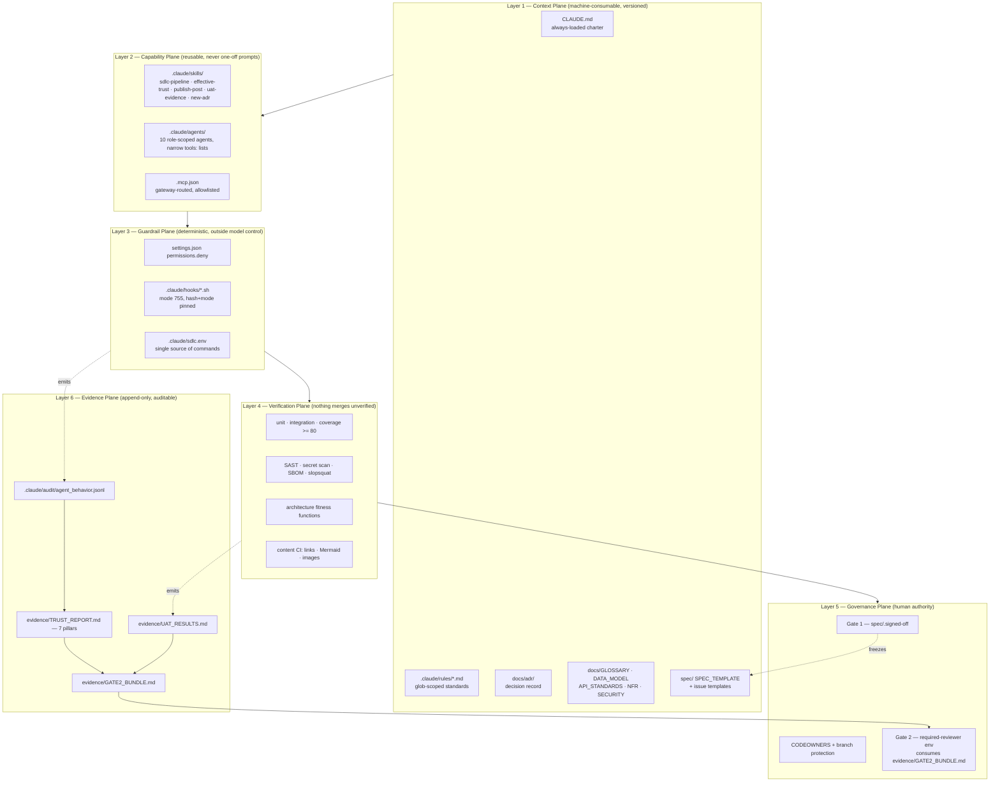

# AI-First Software Factory Assessment — `agent-sentinel-blog`

**Assessed:** 2026-09-07 · **Commit:** `ebfa7c3` · **Branch:** `main`
**Reviewer role:** Enterprise Architect
**Scope note:** The assessment prompt named a "PIM repository." No PIM
repository is attached to this session. This assessment was therefore run
against the repository actually available on the local harness —
`anandnarayanan2017/agent-sentinel-blog` — using the same six-dimension
model. Every finding below cites a file that exists (or is verifiably
absent) in this checkout. Nothing is inferred from the product repository
`anandnarayanan2017/agent-sentinel`, which is not attached here.

---

## 0. What this repository actually is

33 tracked files, 0 lines of application code, 0 test files, no `.github/`
directory. Content splits three ways:

| Group | Files | Nature |
|---|---|---|
| Product blog series | `01-`…`05-*.md` (5 files, ~1,570 words total) | Narrative + 1 Mermaid diagram each |
| Meta / process series | `ai-assisted-coding/` (4 files, ~3,230 words) | Describes the SDLC harness |
| Harness itself | `.claude/` (10 files), `.mcp.json.example`, `CLAUDE.md` | Executable + normative config |
| Diagram exports | `images/` (8 PNGs) | LinkedIn publishing assets |

**The central architectural finding:** this repository is a *partial mirror*
of a governance harness whose executable half lives elsewhere. `.claude/`
was copied verbatim from the product repo (stated in
`ai-assisted-coding/02-worked-example-harness-and-context-in-this-repo.md:5`),
but the artifacts that harness orchestrates — agents, specs, designs,
evidence, ADRs, tests, CI — were not. The result is a repository that
**documents** a factory at maturity 4 while **instantiating** one at
maturity ~1.7.

### Verified dangling references

`CLAUDE.md` — the file with highest precedence for any agent entering this
repo — points at eleven paths that do not exist in this checkout:

```
docs/ARCHITECTURE.md   docs/DESIGN.md   docs/COMPLIANCE.md   docs/adr/
detection/policy.py    detection/baseline.py                 schema/events.py
parsers.py             spec/            design/              evidence/
```

`CLAUDE.md:8` also instructs the reader to "See `README.md`'s Repository
layout tree for the directory map." `README.md` contains no such section
(`grep -in "repository layout" README.md` → no match).

`ai-assisted-coding/02-…md:63` states: *"the ten agents under
`.claude/agents/` (`architect`, `code-reviewer`, `security-reviewer`,
`test-runner`, …) each declare a narrow `tools:` list."* `.claude/agents/`
does not exist in this repository. Twelve agent/skill names are referenced
by `.claude/skills/sdlc-pipeline/SKILL.md` and none are resolvable locally:
`spec-agent`, `architect`, `adr-critic`, `code-reviewer`,
`security-reviewer`, `test-writer`, `test-runner`, `debugger`,
`uat-runner`, `agent-evaluator`, `uat-evidence`, `new-adr`.

This is the single highest-impact defect for agentic operation: an agent
that trusts `CLAUDE.md` will attempt to read a design system that isn't
there.

---

## 1. Context Assets

### Present

| Asset | Location | Purpose | AI-consumable? |
|---|---|---|---|
| Project charter / domain framing | `CLAUDE.md:3-11` | What the product is, regulated-domain framing (DORA, EU AI Act, CSSF) | **Yes** — auto-loaded by Claude Code |
| Coding/domain conventions | `CLAUDE.md:31-41` | `Finding` objects carry `control_refs`; policy-before-baseline ordering; `AgentEvent` normalization boundary | **Yes** — but describes code absent from this repo |
| SDLC operating model | `CLAUDE.md:20-25` | Two human gates, agent-run middle | **Yes** |
| Path-scoped rules index | `.claude/rules/README.md` | Explains the `globs:` frontmatter convention | **Yes** |
| CI supply-chain standard | `.claude/rules/ci-supply-chain.md` (`globs: [".github/workflows/**"]`) | SHA-pinning policy for third-party Actions, ADR requirement, first-party carve-out | **Yes**, but see gap below |
| MCP governance standard | `.claude/rules/mcp-governance.md` (`globs: ["**/*"]`) | Allowlist, gateway-routing, tool-results-are-untrusted | **Yes** — always-on |
| Toolchain + guardrail parameters | `.claude/sdlc.env` | Single source of truth for every command and threshold | **Yes** — sourced directly by hooks |
| MCP server template | `.mcp.json.example` | Gateway-routed server pattern | Partially — it is `.example`, not active config |
| Architecture diagrams | 5 × Mermaid `flowchart` in `01-`…`05-*.md` | Data flow: agent → collector → parser → detection → findings → SIEM | **Yes** (Mermaid is text) — but narrative, not normative |
| Harness/context design rationale | `ai-assisted-coding/01`, `02` | Explains hooks, permissions, phase files, scoped rules | Yes for humans; useful priming for agents |

### Gaps

| Missing asset | Impact |
|---|---|
| **ADRs / `docs/adr/`** | `.claude/rules/ci-supply-chain.md` and `mcp-governance.md` both *mandate* a new ADR for named events. There is no ADR directory and no ADR template. The rule is unfulfillable as written. |
| **Reference architecture** | Only 5 illustrative flowcharts inside blog prose. No canonical, versioned architecture document in this repo. |
| **Sequence diagrams** | Zero. All 5 Mermaid blocks are `flowchart` (LR/TD). No `sequenceDiagram` anywhere — so no temporal/interaction contract exists for an agent to reason about. |
| **API standards / OpenAPI** | None. `POST /ingest` is named in `02-simulation-to-real-models.md`'s diagram only. No schema, no contract, no error taxonomy. |
| **Data model documentation** | `AgentEvent` and `Finding` are named as conventions in `CLAUDE.md` but never defined. No field list, no types, no versioning policy. |
| **Non-functional requirements** | No latency, throughput, retention, or availability targets anywhere. |
| **Security requirements** | Controls exist as *enforcement* (hooks) but not as *requirements*. No `SECURITY.md`, no threat model, no control catalogue. |
| **Domain glossary** | None. "Finding", "control_refs", "egress", "baseline", "policy verdict", "Gate 2" are used without definition. |
| **Business rules** | Referenced as `policies/fintech.yaml` in the product repo; no local copy or excerpt. |
| **Integration standards** | Only the MCP rule. Nothing for SIEM/webhook/Entra ID integration despite `04-` and `05-` describing them. |
| **`LICENSE`** | Absent from a repository whose stated purpose is public publication. |

**Assessment:** context that exists is genuinely machine-consumable (auto-loaded
`CLAUDE.md`, glob-scoped rules, env-file parameterisation — a good pattern).
But it is thin, and its most authoritative file points mostly at things that
aren't here.

---

## 2. Reusable Skills vs Prompts

### Inventory

| Capability | Implementation | Form |
|---|---|---|
| Full SDLC orchestration | `.claude/skills/sdlc-pipeline/SKILL.md` (10 phases, state in `.claude/pipeline-state/phase`) | **C — agent orchestration** |
| Agent trust evaluation | `.claude/skills/effective-trust/SKILL.md` (7 pillars, 0–2 scoring) | **B — reusable skill** |
| MCP allowlisting | `.claude/rules/mcp-governance.md` + `sdlc.env:MCP_ALLOWED_SERVERS` | B — declarative rule |
| Action SHA-pinning | `.claude/rules/ci-supply-chain.md` | B — declarative rule |
| Everything else | — | **Not implemented** |

### Findings

1. **The design is correct; the instantiation is empty.** `sdlc-pipeline`
   is a genuine orchestrator — it explicitly says *"You DISPATCH; you do not
   do phase work yourself"* and enforces writer≠reviewer as an invariant.
   That is category C, and it is well-specified. But it dispatches to twelve
   named agents/skills, **none of which exist in this repo**. Executed here,
   the pipeline halts at Phase 0 or fails at first dispatch.

2. **Phase 0 is a strong pattern worth keeping.** `sdlc-pipeline` refuses to
   run if `sdlc.env` is byte-identical to `sdlc.env.example`, on the reasoning
   that placeholder `"true"` commands would let Gate 2 attest to checks that
   never ran. That is exactly the right failure mode. **However**,
   `.claude/sdlc.env.example` does not exist in this repo, so the `diff -q`
   comparison Phase 0 specifies cannot be performed.

3. **No prompt library, no slash commands.** `.claude/commands/` absent. No
   `.github/copilot-instructions.md`. No prompt templates of any kind. There
   is therefore no *duplicated prompt* problem to fix — the opposite problem
   applies: too few capabilities are captured at all.

4. **MCP is declared but not wired.** `.mcp.json` absent (only
   `.mcp.json.example`), and `sdlc.env:MCP_ALLOWED_SERVERS=""`. The
   governance rule is live; the integration is not.

5. **Reusable CI workflows: none.** No `.github/workflows/` at all, so
   `ci-supply-chain.md`'s `globs: [".github/workflows/**"]` can never
   activate in this repo — a correctly-written rule scoped to a path that
   does not exist.

### Recommendations

- Mirror `.claude/agents/*.md` from the product repo, or replace the
  dispatch list in `sdlc-pipeline` with agents that resolve here.
- Add `.claude/sdlc.env.example` so Phase 0's own guard can execute.
- Add a `.claude/skills/publish-post/SKILL.md` capturing what is currently
  tacit prose in `README.md`'s "Publishing notes" (LinkedIn-verbatim
  structure, Mermaid→PNG export to `images/`, back-link requirement). This
  is the one genuinely repeated, repo-specific workflow here and it lives
  only as human-readable notes.

---

## 3. Architecture Guardrails

### Where stored and how enforced

| Guardrail | Stored | Enforcement mechanism | Agent-consumable |
|---|---|---|---|
| Blocked destructive commands | `.claude/sdlc.env:BLOCKED_COMMAND_PATTERNS` | `guard_pretooluse.sh:16-23` — regex on `tool_input.command`, `exit 2` = hard block | Yes |
| Permission denylist | `.claude/settings.json:permissions.deny` | Harness-level, evaluated before hooks (`terraform apply*`, `git push --force*`, `Read(.env*)`, `Read(**/*secret*)`) | Yes |
| Frozen spec after sign-off | `sdlc.env:FROZEN_PATHS="spec/"` | `guard_pretooluse.sh:74-90` — blocks Edit/Write under frozen paths once `spec/.signed-off` exists; normalizes Windows backslashes first | Yes |
| Security review before commit | `sdlc.env:SENSITIVE_PATHS` | `guard_pretooluse.sh:26-71` — blocks `git commit` when staged sensitive files are newer than the newest `review/SECURITY_*.md` | Yes |
| Dependency integrity | `sdlc.env:SLOPSQUAT_MIN_AGE_DAYS=30` | `slopsquat_guard.sh` — live PyPI/npm existence + age check, `exit 2` | Yes |
| "Done" definition | `sdlc.env:UNIT_TEST_CMD`, `MAX_DEBUG_ITERATIONS=5` | `stop_gate.sh` — refuses Stop while unit tests red during build/debug/test phases, with circuit breaker | Yes |
| Behavioural telemetry | — | `audit_log.sh` — append-only JSONL of every tool call to `.claude/audit/agent_behavior.jsonl` | Yes (substrate for `effective-trust`) |
| Format/lint hygiene | `sdlc.env:FORMAT_CMD`, `LINT_CMD` | `format_posttooluse.sh` — per-file, `.py`-only, non-blocking (lint surfaced to stderr) | Yes |
| Action SHA-pinning standard | `.claude/rules/ci-supply-chain.md` | Advisory only (no CI check) | Yes |
| MCP allowlist | `.claude/rules/mcp-governance.md` + `sdlc.env` | Advisory + evaluator cross-check | Yes |

This is the strongest dimension in the repository. The guardrails are
**deterministic, parameterised in one file, and outside model control** —
architecturally correct. `format_posttooluse.sh:33-38` even passes untrusted
file paths as literal argv rather than through `eval`, and comments explain
why. `guard_pretooluse.sh` deliberately places the security-review gate at
the *commit* boundary rather than the *edit* boundary, with a stated reason
(a read-only reviewer cannot author the fix it reviews). This is considered
design, not boilerplate.

### Critical defect — the enforcement layer is inert as checked out

```
$ git ls-files -s .claude/hooks/
100644 … .claude/hooks/audit_log.sh
100644 … .claude/hooks/format_posttooluse.sh
100644 … .claude/hooks/guard_pretooluse.sh
100644 … .claude/hooks/slopsquat_guard.sh
100644 … .claude/hooks/stop_gate.sh
```

All five hooks are committed **mode `100644` — not executable**.
`.claude/settings.json` invokes each by bare path as a `command` hook. On a
fresh clone, every hook fails to execute. `permissions.deny` still applies
(it is harness-native), but the command-pattern block, the frozen-spec
block, the security-review-before-commit gate, the slopsquat guard, the
stop gate, and the audit log **all silently do nothing**.

This is precisely the failure mode `sdlc-pipeline`'s Phase 0 was written to
prevent — an enforcement layer that appears present and attests to checks
that never ran — reproduced one level down, at the file-mode layer that
Phase 0's hash check does not cover (`sha256sum` records content, not mode).

### Secondary conditions that leave guards unarmed

| Guard | Condition | Status in this repo |
|---|---|---|
| Frozen-spec block | requires `spec/.signed-off` | `spec/` absent → never fires |
| Stop gate | requires `.claude/pipeline-state/phase` ∈ {build,debug,test} | directory absent → `exit 0` at line 13 |
| Security-review gate | requires staged files under `SENSITIVE_PATHS` | `infra/`, `policies/`, `.github/workflows/` all absent; only `.claude/hooks/` exists |
| Format/lint | `.py` files only | 0 `.py` files in repo |
| `SECURITY_SCAN_CMD` (`bandit`) | requires `bandit` on PATH | **not installed** in this environment |
| `IAC_PLAN_CMD` | `="true"` | acknowledged placeholder in `sdlc.env:41-49` |
| `BUILD_CMD` (docker) | requires `infra/docker/Dockerfile` | absent from this repo |

To the repo's credit, `sdlc.env` is unusually candid about its own
placeholders — lines 26-49 document exactly what is and is not verified, and
why `bandit -lll` was chosen over `-ll`. That honesty is a governance asset.

### Missing guardrails

- **Coding standards** — no `ruff.toml`, `pyproject.toml`, `.editorconfig`,
  or style document. `LINT_CMD` invokes `ruff` with zero configuration.
- **Naming standards** — none, for code, branches, or content files.
- **Terraform standards** — none. `IAC_PLAN_CMD="true"`; no `infra/`.
- **API standards** — none.
- **Approved-patterns catalogue** — none.
- **Technology standards / approved-dependency list** — `SLOPSQUAT_WHITELIST=""`;
  no allowed-library policy.
- **Markdown/content standards** — for a content repository, there is no
  linter, no link checker, and no Mermaid validation.

---

## 4. Verification and Quality Gates

### Inventory

| Gate | Present? | Evidence |
|---|---|---|
| Unit tests | **No** | 0 test files; 0 `.py` files |
| Integration tests | **No** | `INTEGRATION_TEST_CMD` defined, nothing to run |
| Coverage gate | **Configured only** | `MIN_COVERAGE=80`, `COVERAGE_CMD` set; no code, never runs |
| Architecture validation | **No** | No fitness functions, no import-boundary checks. `CLAUDE.md`'s "policy before baseline" and "no transport-specific fields past `parsers.py`" rules are unenforced prose. |
| Security scanning | **Configured, unavailable** | `bandit` not installed; no SAST/secret-scan/dependency-scan in CI |
| Code quality | **Partial, non-blocking** | `format_posttooluse.sh` lints on stderr only; `exit 0` always |
| Pull request validation | **No** | No `.github/` — no workflows, no PR template, no issue templates, no `CODEOWNERS` |
| CI/CD | **No** | Zero pipeline definitions in this repo |
| Compliance checks | **Design only** | `effective-trust` 7-pillar model is specified but requires `agent-evaluator` (absent) and `.claude/audit/` (absent) |
| Link/content validation | **No** | No link checker — which is how the `CLAUDE.md` → `docs/*` dangling references survived |

### Can AI-generated code be automatically verified here?

**No.** There is no automated verification of any kind in this repository.
The only gate that can fire on a fresh clone is `settings.json:permissions.deny`,
because it is enforced by the harness rather than by a non-executable script.

Coverage assessment: **0%** of changes to this repository are covered by any
automated check — code, content, links, diagrams, or config.

### Risks

| # | Risk | Severity | Basis |
|---|---|---|---|
| R1 | Enforcement theatre — `.claude/` reads as a governed harness, is inert on clone (mode 644) | **High** | `git ls-files -s .claude/hooks/` |
| R2 | Agents misled by `CLAUDE.md` — 11 dangling paths, plus a pointer to a README section that doesn't exist | **High** | Verified absent |
| R3 | Published claims not true of this repo — `ai-assisted-coding/02` describes `.claude/agents/` in the present tense; readers following the link find nothing | **High** (reputational; this is a public content repo) | `.claude/agents/` absent |
| R4 | No CI, no PR gate, no `CODEOWNERS` — nothing prevents a direct push to `main` from bypassing every stated control | **High** | No `.github/` |
| R5 | Gate 2 depends on a "CI required-reviewer environment" (`CLAUDE.md:24`) that has no definition in this repo | **Medium** | No `.github/` |
| R6 | ADR-mandating rules with no ADR location | **Medium** | `docs/adr/` absent |
| R7 | Phase 0's own placeholder guard cannot execute (`sdlc.env.example` absent) | **Medium** | Verified absent |
| R8 | Trust-evaluation hash check covers content, not file mode — cannot detect R1 | **Medium** | `effective-trust/SKILL.md` step 1 |
| R9 | No `LICENSE` on a repo intended for public republication | **Low** | Verified absent |

---

## 5. Agent Workflow Readiness

| Agent | Context available | Inputs available | Outputs it could produce | Blocking gaps |
|---|---|---|---|---|
| **Business Analysis** | `CLAUDE.md:3-11` domain framing; 5 blog posts describing user problems | **None.** No `spec/`, no issue templates, no work-item templates, no backlog, no personas, no acceptance-criteria format | `spec/SPEC.md`, acceptance criteria | No requirements intake path at all; no `spec/` directory to write into; Gate 1's `spec/.signed-off` convention has no home |
| **Architecture** | `CLAUDE.md` conventions (policy-first, `AgentEvent` boundary); 5 Mermaid flowcharts; `docs/` referenced but absent | Partial — narrative only | `design/DESIGN.md`, ADRs, C4/sequence diagrams | No ADR directory or template despite two rules mandating ADRs; no NFRs; no existing architecture baseline to diff against |
| **API Design** | Effectively none — `POST /ingest` appears once, inside a diagram label | **None** | OpenAPI spec, error taxonomy, versioning policy | No API standards, no schema, no existing contract |
| **Implementation** | `CLAUDE.md` conventions; `sdlc.env` toolchain | **None** — 0 source files, no `pyproject.toml`, no dependency manifest | Source code | Nothing to build on; `BUILD_CMD` targets an absent `infra/docker/Dockerfile` |
| **Test** | `MIN_COVERAGE=80`, `UNIT_TEST_CMD`, `INTEGRATION_TEST_CMD` in `sdlc.env` | **None** — no code, no spec to derive tests from, no fixtures, no test framework config | Unit/integration suites, coverage report | `sdlc-pipeline` Phase 6 requires a spec-derived test-writer; neither the spec nor the agent exists |
| **Security** | **Best-supported.** `.claude/rules/mcp-governance.md`, `ci-supply-chain.md`, `settings.json:permissions.deny`, `guard_pretooluse.sh`, `slopsquat_guard.sh`, `effective-trust` 7 pillars | Partial — rules yes; `review/SECURITY_*.md` convention defined in the hook | `review/SECURITY_<name>.md`, `evidence/TRUST_REPORT.md` | `review/` and `evidence/` absent; `.claude/audit/agent_behavior.jsonl` never produced (hook non-executable); `bandit` not installed; no threat model |
| **Documentation** | **Strong.** `README.md` publishing notes (LinkedIn-verbatim structure, Mermaid→PNG in `images/`, back-link rule); 9 worked examples of house style; `ai-assisted-coding/` sets tone | Yes — the richest input set in the repo | New posts, diagram exports, README index updates | Style conventions are prose in `README.md`, not a skill; no link checker to validate what it writes |

**Overall readiness:** only the Documentation agent and (partially) the
Security agent could operate productively today. The five agents in the
build path — BA, Architecture, API, Implementation, Test — have no inputs.
The orchestrator that would dispatch them (`sdlc-pipeline`) cannot resolve
a single one of its named subagents in this repo.

---

## 6. Software Factory Maturity Score

Scale: 0 Not Present · 1 Ad Hoc · 2 Partially Defined · 3 Standardized ·
4 Governed · 5 Software Factory Ready

| Dimension | Score | Justification |
|---|---|---|
| **Context Assets** | **2** | `CLAUDE.md` + glob-scoped rules + `sdlc.env` are genuinely AI-consumable and well-structured. But no ADRs, no NFRs, no glossary, no data model, no API contract, no sequence diagrams — and `CLAUDE.md` points at 11 paths that don't exist. |
| **Skills** | **2** | Two well-designed skills (`sdlc-pipeline`, `effective-trust`) at the right abstraction — orchestration, not prompts. Neither is executable here: 12 dispatch targets unresolvable, `.claude/agents/` absent, `.claude/commands/` absent, no `.mcp.json`. Design would score 4; instantiation scores 1. |
| **Guardrails** | **2** | Best-designed dimension: deterministic, single-source-parameterised, outside model control, with considered details (argv-not-eval, commit-boundary review gate, Windows path normalization). Downgraded from 4 because all five hooks are committed mode `644` and cannot execute on clone; several guards depend on directories that don't exist; no coding/naming/API/Terraform standards. |
| **Verification** | **1** | No tests, no CI, no PR validation, no `CODEOWNERS`, no security scanning available, no architecture fitness functions, no link checking. Commands are configured in `sdlc.env` but nothing invokes them. Coverage of automated verification: 0%. |
| **Agent Readiness** | **2** | Documentation agent well-served; Security agent partially. BA, Architecture, API, Implementation, and Test agents have no inputs. Role separation (writer≠reviewer, evaluator≠reviewer) is correctly specified but unenforceable without the agent definitions. |
| **Governance** | **2** | Two-gate model, non-negotiables, `HITL_MODE` dial, and a 7-pillar trust model are all clearly documented in `CLAUDE.md` and `effective-trust/SKILL.md` — a real governance *design*. Nothing enforces it: no branch protection artifacts, no `CODEOWNERS`, no required-reviewer environment, no `SECURITY.md`, no `LICENSE`, no `evidence/` bundle path. |
| **Weighted average** | **1.83 / 5** | **Partially Defined** — governance is documented, not enforced |

---

## Executive Summary

`agent-sentinel-blog` is a public content repository that additionally ships
a verbatim copy of the `.claude/` SDLC harness used to build the private
Agent Sentinel product. Assessed as an AI-First Software Factory it scores
**1.83/5 (Partially Defined)**.

The gap is not one of understanding. The governance *model* here is more
sophisticated than most enterprise repositories: deterministic hooks outside
model control, a single parameterisation file, path-scoped rule loading,
explicit writer/reviewer/evaluator role separation, a phase-state file for
crash-resumable orchestration, an append-only behavioural audit log, and a
Phase 0 guard whose stated purpose is to prevent evidence bundles attesting
to checks that never ran. That is a maturity-4 design.

The gap is one of **instantiation and drift**. The harness was mirrored;
everything it acts upon was not. Concretely: five hooks are committed
non-executable and therefore inert on any fresh clone; twelve agents and
skills the orchestrator dispatches to do not exist; `CLAUDE.md` directs
agents to eleven absent paths and to a README section that was never
written; two rules mandate ADRs into a directory that does not exist; and
there is no CI, no test, and no PR gate of any kind.

For a repository whose product thesis is *"a prompt that says 'never run
`terraform apply`' is advice; a hook that inspects the command string and
exits 2 is enforcement"* (`ai-assisted-coding/01-…md:38-41`), the file-mode
defect is the finding that matters most — it converts the enforcement layer
back into advice, invisibly.

## Strengths

1. **Guardrail design is genuinely enterprise-grade** — `guard_pretooluse.sh`,
   `slopsquat_guard.sh`, `stop_gate.sh`, `settings.json:permissions.deny`.
2. **Single source of truth for commands** — `.claude/sdlc.env`; `CLAUDE.md:17`
   states "read it; never guess commands." No command is hard-coded elsewhere.
3. **Context engineering is deliberate** — glob-scoped rules load only on
   matching paths; verbose output is confined to subagents; phase state is
   durable.
4. **Role separation is architectural, not advisory** — writer≠reviewer and
   evaluator≠reviewer are stated as pipeline invariants.
5. **Unusual honesty about its own limits** — `sdlc.env:26-49` documents
   exactly which commands are verified, which are placeholders, and why
   `bandit -lll` was chosen over `-ll`. `effective-trust/SKILL.md:8-10`
   caveats its own pillar-naming. This is the raw material for an evidence
   bundle an auditor could actually trust.
6. **All 16 internal documentation links in `ai-assisted-coding/` resolve.**

## Weaknesses

1. Hooks committed mode `644` — the entire enforcement layer is inert on clone.
2. `.claude/agents/` absent — the orchestrator has nothing to dispatch to.
3. `CLAUDE.md` cites 11 non-existent paths + 1 non-existent README section.
4. No `.github/` — no CI, no PR template, no issue templates, no `CODEOWNERS`.
5. Zero tests and zero automated verification of any kind.
6. No ADR directory, though two rules mandate ADRs.
7. Published prose (`ai-assisted-coding/02`) describes repository contents
   in the present tense that this repository does not contain.
8. No `LICENSE` on a repository built for public republication.
9. Trust-evaluation hash check covers file content but not file mode, so it
   cannot detect weakness #1.
10. No glossary, NFRs, data model, API contract, or sequence diagram.

## Quick Wins — 30 days

| # | Action | Files | Closes |
|---|---|---|---|
| Q1 | `git update-index --chmod=+x .claude/hooks/*.sh` and commit | `.claude/hooks/*` | R1 — restores all enforcement |
| Q2 | Extend `effective-trust` Pillar 4 to hash **mode + content**: `stat -c '%n %a' .claude/hooks/*` alongside `sha256sum` | `.claude/skills/effective-trust/SKILL.md` | R8 — makes Q1 non-regressible |
| Q3 | Reconcile `CLAUDE.md` with reality: add the Repository-layout tree to `README.md`, and mark product-repo-only paths explicitly as such | `CLAUDE.md`, `README.md` | R2 |
| Q4 | Add `.github/workflows/content-ci.yml`: markdown link check + Mermaid parse + `images/` reference check, on PR. SHA-pin every third-party Action per `ci-supply-chain.md`, with the ADR that rule requires | `.github/workflows/`, `docs/adr/0001-*.md` | R4, R6, activates the `ci-supply-chain` glob |
| Q5 | Add `docs/adr/` with `0000-template.md` and a README stating the ADR contract | `docs/adr/` | R6 |
| Q6 | Add `CODEOWNERS`, `.github/pull_request_template.md` (with a "which guardrails did you touch?" checkbox), and `LICENSE` | `.github/`, root | R4, R9 |
| Q7 | Add `.claude/sdlc.env.example` so Phase 0's own guard can execute | `.claude/` | R7 |
| Q8 | Correct the present-tense claims in `ai-assisted-coding/02` about `.claude/agents/`, or mirror the agents (Q9) | `ai-assisted-coding/02-*.md` | R3 |

## Medium-term — 90 days

| # | Action | Closes |
|---|---|---|
| M1 | Mirror `.claude/agents/*.md` (all 10) from the product repo so `sdlc-pipeline` resolves end-to-end; add the missing `uat-evidence` and `new-adr` skills | Skills → 4, Agent Readiness → 3 |
| M2 | Author `docs/GLOSSARY.md` (Finding, AgentEvent, control_refs, Gate 1/2, policy verdict, baseline, egress) and `docs/DATA_MODEL.md` defining `AgentEvent` and `Finding` field-by-field with a versioning policy | Context Assets → 3 |
| M3 | Publish `docs/API_STANDARDS.md` + an OpenAPI stub for the collector (`POST /ingest`), including error taxonomy | Enables API Design agent |
| M4 | Add `docs/NFR.md` (latency, retention, throughput, availability) and `SECURITY.md` (threat model, disclosure policy, control catalogue mapped to DORA / EU AI Act / CSSF) | Context Assets → 3, Governance → 3 |
| M5 | Convert `README.md`'s publishing notes into `.claude/skills/publish-post/SKILL.md` — the one genuinely repeatable workflow here | Skills → 4 |
| M6 | Add `.github/ISSUE_TEMPLATE/` work-item templates with a machine-readable acceptance-criteria block, and create `spec/` with a `SPEC_TEMPLATE.md` | Unblocks the BA agent; makes Gate 1 real |
| M7 | Add at least one `sequenceDiagram` for the ingest→detect→finding→SIEM path; standardise diagrams as versioned assets under `docs/`, with `images/` generated from them | Context Assets → 3 |
| M8 | Stand up the Gate 2 required-reviewer GitHub environment referenced by `CLAUDE.md:24`, and wire `evidence/GATE2_BUNDLE.md` as its required input | Governance → 4 |
| M9 | Architecture fitness functions in CI — e.g. assert `detection/policy.py` is imported before `detection/baseline.py`, and that no transport-specific field escapes `parsers.py`. Turns two `CLAUDE.md` conventions into enforced constraints | Verification → 3 |

## Target Software Factory Architecture



**Design principles this target enforces**

1. **Every guardrail is executable and mode-pinned.** Content hashes are not
   sufficient — file mode is part of the enforcement surface (Q1 + Q2).
2. **Context is an asset with a location, an owner, and a lifecycle.** No
   normative statement lives only in blog prose; if an agent must obey it,
   it lives in `CLAUDE.md`, `.claude/rules/`, or `docs/` and is referenced
   by a path that resolves.
3. **Capabilities are skills and agents, never one-off prompts.** A workflow
   performed twice becomes a skill; a role performed by an agent gets an
   explicit narrow `tools:` list.
4. **Verification is the merge condition, not a recommendation.** Everything
   in `sdlc.env` is invoked by CI, not only by hooks — so the gate survives a
   developer who clones without the harness.
5. **Humans hold exactly two authorities** — define the requirement (Gate 1)
   and authorise production (Gate 2) — and both are technically enforced by
   branch protection and a required-reviewer environment, not by convention.
6. **Evidence is produced as a by-product of enforcement**, not assembled
   retrospectively. The audit log is written by the same hooks that enforce,
   which is what makes the Gate 2 bundle attestable.


---

# Addendum — product repository analysed, and quick wins landed

**Added:** 2026-09-07 · **Product repo:** `anandnarayanan2017/agent-sentinel@110e2fb`
(attached to the session and cloned after the assessment above was written)

The original assessment could only see the mirror. With the product repo
attached, several findings resolve differently — and one gets considerably
worse.

## A1. What the product repo actually contains

| Area | Product repo | Mirror |
|---|---|---|
| Agents | **10** under `.claude/agents/` | absent |
| Skills | **6** (`sdlc-pipeline`, `effective-trust`, `new-adr`, `uat-evidence`, `design-from-adr`, `deploy`) | 2 |
| ADRs | **8** under `docs/adr/` (0001-0008) | absent |
| CI | **3** workflows (`ci.yml`, `agent-pipeline.yml`, `sentinel-nightly.yml`, the last 231 lines) | none |
| Gate 2 | real — `environment: production` with required reviewers (`agent-pipeline.yml:45`) | none |
| Pipeline artifacts | `spec/` (SPEC, ACCEPTANCE, UAT), `design/` (DESIGN, CRITIC_VERDICT), `evidence/` (GATE2_BUNDLE, TRUST_REPORT, UAT_RESULTS), `review/` (4 security reviews) | none |
| Code / tests | 72 app modules, 22 test files | 0 |
| Compliance | `docs/COMPLIANCE.md`, `docs/compliance/standards-map.md` | none |
| Other | `LICENSE`, `CONTRIBUTING.md`, `.gitattributes` | none |

So the maturity scores in the body of this document are scores for **the
mirror**, not for the programme. The product repository is materially more
mature on every dimension: Verification is a genuine 3 (SHA-pinned
third-party Actions with matching ADRs 0006/0007, nightly Postgres +
TimescaleDB smoke tests asserting real findings), and Governance a genuine
3-4 (a `production` environment gated on required reviewers, with a
release-labelled PR required to carry a Gate 2 bundle and a trust report).

**The "copied verbatim" claim checks out.** All 13 shared `.claude/` files
were byte-identical by git blob hash at the time of assessment — hooks,
rules, `sdlc.env`, `settings.json`, both shared skills, `.mcp.json.example`.
The mirror's problem was never fidelity; it was **completeness** (16 files
never copied) and now, deliberately, two files that are ahead (A3).

## A2. Finding R1 is worse than reported: it is in the product repo too

`git ls-files -s .claude/hooks/` on the product repo returns mode `100644`
for all five hooks — the same defect. It was not a mirroring artifact.

Verified empirically against the product checkout: dispatching
`guard_pretooluse.sh` on a forbidden command returns **exit 126
("Permission denied")**, not the exit 2 that means *blocked*. Claude Code
treats 2 as blocking and every other non-zero exit as a non-blocking error,
so **the enforcement layer fails open**. Concretely, in the repository that
has live CI, a `production` environment and real Terraform paths:

- forbidden commands were permitted, not denied;
- `slopsquat_guard.sh` waved through package installs;
- `stop_gate.sh` allowed "done" on red tests;
- `audit_log.sh` wrote nothing — removing the substrate all seven
  `effective-trust` pillars are scored from, while `evidence/TRUST_REPORT.md`
  continued to exist.

**Why nobody caught it.** The product repo's own
`review/SECURITY_harness_enforcement_fixes.md` reviewed these exact hooks
carefully — injection sinks, `set -euo pipefail` behavior, mtime edge
cases, fail-open vs fail-closed direction of the backslash normalization —
and concluded "both real enforcement chokepoints are intact." That was
accurate about content. Mode was never examined. The repo had even solved
the adjacent problem: `.gitattributes` pins `*.sh text eol=lf` so a CRLF
checkout cannot break a hook. Line endings were governed; the exec bit was
not. This is the precise blind spot Pillar 4's content-only `sha256sum`
could not close, and it upgrades R8 from Medium to **High**.

## A3. Quick wins landed on this branch

| Win | Change | Verification |
|---|---|---|
| Q1 | `git update-index --chmod=+x .claude/hooks/*.sh` — all five now `100755`, content untouched (blob hashes unchanged) | forbidden command now `exit=2` with the BLOCKED message; `ls -la` still `exit=0` |
| Q2 | `effective-trust` Pillar 4 now fingerprints **content and mode** (`stat -c '%n %a'`), plus new fail-closed step 1a: any non-executable hook is Pillar 4 = 0 and a HALT | reviewed in `review/SECURITY_harness-mode-enforcement.md` |
| Q2b | `sdlc-pipeline` Phase 0 records mode alongside the content hash, so recorder and verifier stay symmetric | as above |

A hand-written `review/SECURITY_harness-mode-enforcement.md` accompanies the
change, as `guard_pretooluse.sh`'s own commit gate requires. **It carries an
explicit caveat**: the real `security-reviewer` agent is not mirrored here,
so writer and reviewer were the same agent — the pipeline's central
invariant could not be satisfied structurally. That is recorded in the
review rather than papered over, and the same fix must go through the real
reviewer in the product repo.

### A live demonstration, unplanned

Immediately after Q1, an attempt to author documentation *about* the
forbidden commands was itself blocked — `BLOCKED_COMMAND_PATTERNS` is
grepped against the whole `tool_input.command` string, so a heredoc quoting
a forbidden phrase matches. The guard was working, seconds after being
re-armed. It is fail-closed and therefore acceptable, but it is a real
false-positive characteristic worth knowing: prose that quotes blocked
patterns must be written with a file-write tool, not a shell heredoc. It was
simply unobservable while the hooks were inert.

## A4. Blog ↔ repo alignment

| Claim in the blog | Status |
|---|---|
| "`.claude/` copied verbatim from the product repo" | **Was over-broad** — true for the 13 files present, but 16 were never copied. Now scoped explicitly in `ai-assisted-coding/02`. |
| "the ten agents under `.claude/agents/`" | **Was false for this repo** — they exist in the product repo only. Corrected, and the post now carries the verified `tools:`/model table for all ten. |
| `agent-evaluator` gets `Read, Grep, Glob, Bash` only | **Verified true** (`.claude/agents/agent-evaluator.md`) |
| Rules are path-scoped by frontmatter `globs:` | **Verified true** (`ci-supply-chain.md`, `mcp-governance.md`) |
| Parts 1-5 are the whole series | **Stale** — the product repo has Parts 6-10 (Series 2, the ADR-0008 network collector) plus `docs/blog/linkedin/` variants, unmirrored. Now flagged in `README.md`. |

Parts 1-5 diverge from the product repo's versions by 60-189 lines each, but
that is the deliberate short dual-audience rewrite (commit `7cee217`), not
drift. The `ai-assisted-coding/` posts diverged only by added relative links
— before this change.

## A5. Revised priorities

R1 (now product-repo-wide, fails open) supersedes everything else in the
original quick-wins list. In priority order:

1. **Apply Q1/Q2/Q2b to the product repository**, through the real
   `security-reviewer`. That repo is the one with a `production` environment.
2. **Add a CI assertion so this cannot regress**: a job that fails if any
   `.claude/hooks/*.sh` is not executable. `.gitattributes` cannot express
   the exec bit, so CI is the enforcement point.
3. **Re-run `effective-trust` against a real audit log.** Every trust report
   produced while `audit_log.sh` was inert was scored on an empty or absent
   substrate and should be treated as unevidenced.
4. Then resume the original Q3-Q8 / M1-M9 list.
